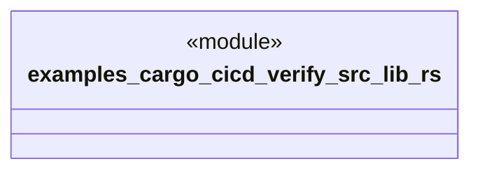

# `examples/cargo-cicd-verify/src/lib.rs`

Source SHA-256: `de317c7f20d18d2af47d347328e1b535403d002d49d9f29dbe38dc888ce56456`

## Dependencies

- None observed.

## Standing

- Structural parse: `ALIVE`
- Runtime behavior: `UNKNOWN`
