# `examples/cargo-cicd-verify/tests/cargo_cicd_dispatch_proof.rs`

Source SHA-256: `8f4f2d3c6afda5b736e9f97e315bd2d67c2cf922cc33853270d19a50b5b30e32`

```mermaid
classDiagram
    class mod_cargo_cicd_dispatch {
      <<generated>>
    }
    class mod_cargo_cicd_catalog {
      <<generated>>
    }
    class fn_args_of {
      <<generated>>
    }
    class fn_build_command_targets_the_real_cargo_cicd_binary {
      <<generated>>
    }
    class fn_build_command_places_noun_then_verb_before_extra_args {
      <<generated>>
    }
    class fn_build_command_with_no_extra_args_is_exactly_noun_verb {
      <<generated>>
    }
    class fn_rows_query_returned_at_least_one_command {
      <<generated>>
    }
    class fn_dispatch_row_count_is_catalog_row_count_minus_deprecated_bare_verb_rows {
      <<generated>>
    }
    class fn_every_generated_wrapper_builds_its_documented_noun_verb_pair {
      <<generated>>
    }
    class fn_doctor_bare_verb_row_has_no_generated_wrapper_but_real_doctor_verbs_do {
      <<generated>>
    }
    class fn_dispatch_returns_a_real_not_found_error_when_cargo_cicd_binary_is_absent {
      <<generated>>
    }
    class fn_generated_wrapper_propagates_the_real_spawn_error {
      <<generated>>
    }
```

## Dependencies

- `cargo_cicd_catalog::CARGO_CICD_COMMANDS`
- `cargo_cicd_dispatch::*`

## Standing

- Structural parse: `ALIVE`
- Runtime behavior: `UNKNOWN`
