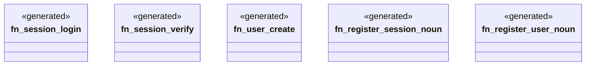

# `examples/clap-noun-verb-cli/src/clap_noun_verb_routes.rs`

Source SHA-256: `caef5c0a8d58832b2510da2dafba03fbc7c3d6818d852201ec7459dcaae2ce30`

## Dependencies

- `clap_noun_verb::Result`
- `clap_noun_verb_macros::verb`

## Standing

- Structural parse: `ALIVE`
- Runtime behavior: `UNKNOWN`
