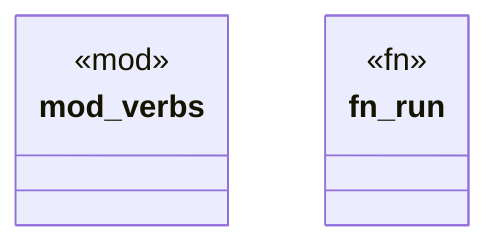

# `examples/clap-noun-verb-cli/src/lib.rs`

Source SHA-256: `99827027e1e12ac69f06e97646a2cda8a41816b9f03e45e7d061f501c6ba572e`

## Dependencies

- `clap_noun_verb::Result`

## Standing

- Structural parse: `ALIVE`
- Runtime behavior: `UNKNOWN`
