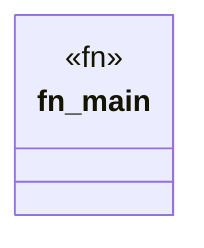

# `examples/clap-noun-verb-cli/src/main.rs`

Source SHA-256: `4d6e32fcf6ece00fb6030c352b190296d03031524610ee0ecf9342204abc4eff`

## Dependencies

- `std::process`

## Standing

- Structural parse: `ALIVE`
- Runtime behavior: `UNKNOWN`
