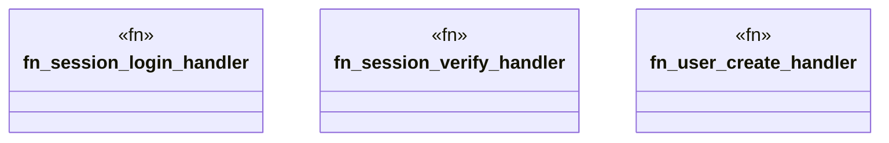

# `examples/clap-noun-verb-cli/src/verbs/handlers.rs`

Source SHA-256: `7e184db65e373217bfa4b47d9cde43b72685d41594905b988677507e5dbdca17`

## Dependencies

- `clap_noun_verb::Result`
- `serde_json::{json, Value}`

## Standing

- Structural parse: `ALIVE`
- Runtime behavior: `UNKNOWN`
