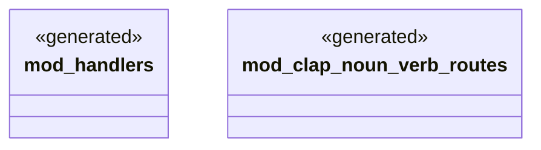

# `examples/clap-noun-verb-cli/src/verbs/mod.rs`

Source SHA-256: `214bda802e4f5b91eee7429589043a1b3933d9802185d1b08c6289395df0cf01`

## Dependencies

- None observed.

## Standing

- Structural parse: `ALIVE`
- Runtime behavior: `UNKNOWN`
