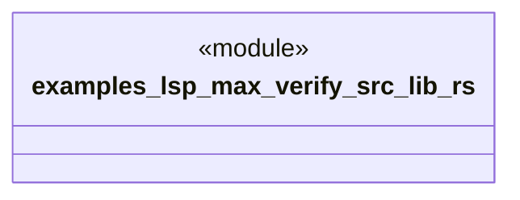

# `examples/lsp-max-verify/src/lib.rs`

Source SHA-256: `9d961e4b97caf8d204fdb01562825564295a9b2a441e4d708f755bc7eacc0c42`

## Dependencies

- None observed.

## Standing

- Structural parse: `ALIVE`
- Runtime behavior: `UNKNOWN`
