# `examples/lsp-max-verify/tests/lsp_max_rule_pack_proof.rs`

Source SHA-256: `00f87e510b7eb72e1f0fc2e0e364492609f564f67c9082bde44498e6b75339c0`

```mermaid
classDiagram
    class struct_ParsedRule {
      <<struct>>
      +"id: String"
      +"name: String"
      +"severity: String"
      +"pattern: String"
      +"path_globs: Vec~String~"
      +"exclude_globs: Vec~String~"
      +"message: String"
      +"rationale: String"
      +"eval_budget: String"
    }
    class struct_ParsedRulePackFile {
      <<struct>>
      +"rules: Vec~ParsedRule~"
    }
    class struct_Expected {
      <<struct>>
      +"id: &'static str"
      +"name: &'static str"
      +"severity: &'static str"
      +"pattern: &'static str"
      +"eval_budget: &'static str"
      +"message: &'static str"
      +"rationale: &'static str"
      +"positive: &'static [&'static str]"
      +"negative: &'static [&'static str]"
    }
    class fn_read_generated_rule_files {
      <<fn>>
    }
    class fn_exactly_three_rule_files_are_generated {
      <<fn>>
    }
    class fn_every_generated_rule_matches_one_hand_transcribed_expectation {
      <<fn>>
    }
    class fn_every_generated_pattern_compiles_as_a_real_regex {
      <<fn>>
    }
    class fn_unwrap_rule_regex_matches_real_unwrap_and_expect_call_sites {
      <<fn>>
    }
    class fn_raw_protocol_rule_regex_matches_real_serde_json_fallback_usage {
      <<fn>>
    }
    class fn_wall_clock_rule_regex_matches_real_systemtime_and_instant_now_usage {
      <<fn>>
    }
    class fn_generated_catalog_markdown_lists_all_three_rules_exactly_once {
      <<fn>>
    }
```

## Dependencies

- `regex::Regex`
- `serde::Deserialize`
- `std::fs`
- `std::path::Path`

## Standing

- Structural parse: `ALIVE`
- Runtime behavior: `UNKNOWN`
