# `examples/lsp-max-verify/tests/lsp_max_rule_pack_sparql_derived_proof.rs`

Source SHA-256: `c599d5624dbcae5860d04e7a6d387678cfd9d3bd068e4f9b0e90ea5e7eb67175`

```mermaid
classDiagram
    class struct_LiveRule {
      <<struct>>
      +"rule_id: &'static str"
      +"name: &'static str"
      +"severity: &'static str"
      +"pattern: &'static str"
      +"path_globs: &'static [&'static str]"
      +"exclude_globs: &'static [&'static str]"
      +"eval_budget: &'static str"
      +"message: &'static str"
      +"rationale: &'static str"
    }
    class fn_all_generated_rule_toml {
      <<fn>>
    }
    class fn_assert_rule_in_toml {
      <<fn>>
    }
    class fn_assert_rule_in_md {
      <<fn>>
    }
    class fn_sparql_query_returned_at_least_one_rule {
      <<fn>>
    }
    class fn_rule_count_matches_generated_toml_files_right_now {
      <<fn>>
    }
    class fn_every_live_rule_matches_generated_artifacts_right_now {
      <<fn>>
    }
    class fn_live_row_order_is_lexical_ascending_by_rule_id_in_markdown_catalog {
      <<fn>>
    }
    class fn_generated_artifacts_reject_unknown_rule_id {
      <<fn>>
    }
```

## Dependencies

- `std::fs`
- `std::path::Path`

## Standing

- Structural parse: `ALIVE`
- Runtime behavior: `UNKNOWN`
