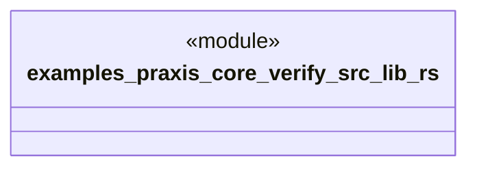

# `examples/praxis-core-verify/src/lib.rs`

Source SHA-256: `a9c4cf91acd961c8db836fd044245501f827a7d38d43eba1b626f847f59b607d`

## Dependencies

- None observed.

## Standing

- Structural parse: `ALIVE`
- Runtime behavior: `UNKNOWN`
