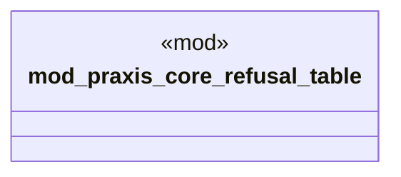

# `examples/praxis-core-verify/src/praxis_core_lib_wiring.rs`

Source SHA-256: `26a233ed1f6d09072e24c48c4187e1931302d8f008339360a928fbb35b8acdfb`

## Dependencies

- `praxis_core_refusal_table::{ category_for_scenario, denial_lane_for_scenario, RefusalTaxonomyRow, PRAXIS_CORE_REFUSAL_TAXONOMY, }`

## Standing

- Structural parse: `ALIVE`
- Runtime behavior: `UNKNOWN`
