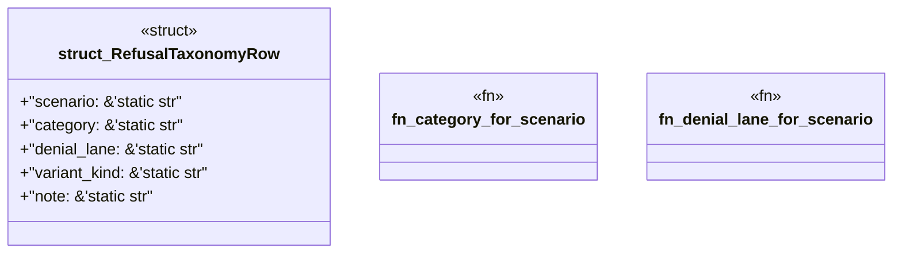

# `examples/praxis-core-verify/src/praxis_core_refusal_table.rs`

Source SHA-256: `3dbffc7b3454de8f1705d29b5174f019b5ae355b9ef629a7845e927fe863cba5`

## Dependencies

- None observed.

## Standing

- Structural parse: `ALIVE`
- Runtime behavior: `UNKNOWN`
