# `examples/praxis-core-verify/tests/praxis_core_refusal_taxonomy_proof.rs`

Source SHA-256: `f1b44cc8f436e6164a2806284f41c01a7e024c8b65340457c5f3870fc60d62d6`

```mermaid
classDiagram
    class fn_assert_row_rs {
      <<fn>>
    }
    class fn_assert_row_md {
      <<fn>>
    }
    class fn_rs_table_has_exactly_thirteen_rows {
      <<fn>>
    }
    class fn_md_table_has_exactly_thirteen_rows {
      <<fn>>
    }
    class fn_every_scenario_row_matches_ontology {
      <<fn>>
    }
    class fn_row_order_is_lexical_ascending_by_scenario {
      <<fn>>
    }
    class fn_generated_lookup_functions_agree_with_table_for_every_scenario {
      <<fn>>
    }
    class fn_generated_table_rejects_unknown_scenario_name {
      <<fn>>
    }
    class fn_exactly_the_thirteen_known_scenarios_are_present {
      <<fn>>
    }
    class mod_live_fidelity {
      <<mod>>
    }
    class fn_live_refusal_rs_variant_count_matches_generated_table {
      <<fn>>
    }
```

## Dependencies

- `praxis_core::refusal::{RefusalCategory, RefusalScenario}`

## Standing

- Structural parse: `ALIVE`
- Runtime behavior: `UNKNOWN`
