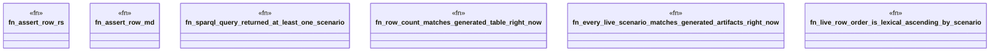

# `examples/praxis-core-verify/tests/praxis_core_refusal_taxonomy_sparql_derived_proof.rs`

Source SHA-256: `ad4d7f988bbfdc27be46aa5be86faee356dba61f128ebd340bf7e20959b9ce58`

## Dependencies

- None observed.

## Standing

- Structural parse: `ALIVE`
- Runtime behavior: `UNKNOWN`
