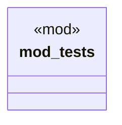

# `examples/praxis-core-verify/tests/praxis_core_refusal_verbatim_reference_tests.rs`

Source SHA-256: `2d3254ae0bdb3784375f685614e153ec087661033ba70552bfca52abce26e7da`

## Dependencies

- `bcinr_powl_receipt::denial::DenialPolarity`
- `praxis_core::law::Obligation`
- `praxis_core::refusal::{ compose_denials, denial_lane, scenario_for_denial_lane, RefusalCategory, RefusalScenario, }`
- `super::*`

## Standing

- Structural parse: `ALIVE`
- Runtime behavior: `UNKNOWN`
