# `examples/receiptctl/src/clap_noun_verb_routes.rs`

Source SHA-256: `b52c33dd7b4a21f48dd114f682be54bdb465b0fe6d15f0e11a44106d1042cfc1`

```mermaid
classDiagram
    class fn_algorithm_list {
      <<generated>>
    }
    class fn_cognition_list {
      <<generated>>
    }
    class fn_receipt_emit {
      <<generated>>
    }
    class fn_session_login {
      <<generated>>
    }
    class fn_session_ping {
      <<generated>>
    }
    class fn_session_verify {
      <<generated>>
    }
    class fn_user_create {
      <<generated>>
    }
    class fn_register_algorithm_noun {
      <<generated>>
    }
    class fn_register_cognition_noun {
      <<generated>>
    }
    class fn_register_receipt_noun {
      <<generated>>
    }
    class fn_register_session_noun {
      <<generated>>
    }
    class fn_register_user_noun {
      <<generated>>
    }
    class mod_clap_noun_verb_routes_proof_tests {
      <<generated>>
    }
```

## Dependencies

- `clap_noun_verb::Result`
- `clap_noun_verb_macros::verb`
- `serde_json::json`
- `super::*`

## Standing

- Structural parse: `ALIVE`
- Runtime behavior: `UNKNOWN`
