# `examples/receiptctl/src/ggen_pack_mods.rs`

Source SHA-256: `15dfce616acda2899a0d21fffbcb5e24070d89e1c2c1aa9166d7dd2fef398a03`

```mermaid
classDiagram
    class mod_clap_noun_verb_routes {
      <<generated>>
    }
    class mod_sandbox_actuator_trait {
      <<generated>>
    }
    class mod_sandbox_catalog {
      <<generated>>
    }
    class mod_w4pm_algorithms_catalog {
      <<generated>>
    }
    class mod_w4pm_algorithms_invocation_dispatch {
      <<generated>>
    }
    class mod_w4pm_cognition_catalog {
      <<generated>>
    }
    class mod_w4pm_cognition_dispatch {
      <<generated>>
    }
    class mod_w4pm_cognition_dispatch_handler {
      <<generated>>
    }
    class mod_wasm4pm_compat_events {
      <<generated>>
    }
    class mod_wasm4pm_facts_registry {
      <<generated>>
    }
```

## Dependencies

- None observed.

## Standing

- Structural parse: `ALIVE`
- Runtime behavior: `UNKNOWN`
