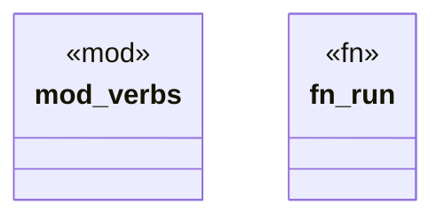

# `examples/receiptctl/src/lib.rs`

Source SHA-256: `5f786d97947ae0ee9494c7758f587af59cf716697d1dd0514137489f2949fd9f`

## Dependencies

- `clap_noun_verb::Result`

## Standing

- Structural parse: `ALIVE`
- Runtime behavior: `UNKNOWN`
