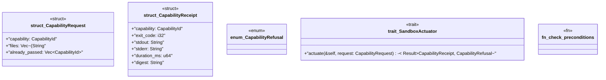

# `examples/receiptctl/src/sandbox_actuator_trait.rs`

Source SHA-256: `8d338cd68616858629a7f06e39253f2906f00bd69911333c651236b6399fca7c`

## Dependencies

- `crate::sandbox_catalog::CapabilityId`

## Standing

- Structural parse: `ALIVE`
- Runtime behavior: `UNKNOWN`
