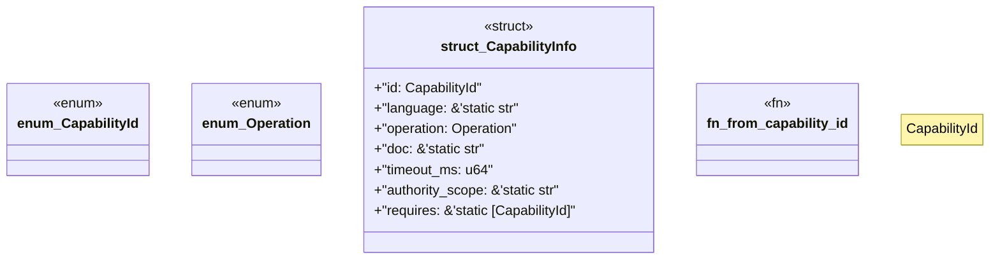

# `examples/receiptctl/src/sandbox_catalog.rs`

Source SHA-256: `75d0de60b06de2696211a22168f46037e867ec61df6671f80080ab2be6a99fa5`

## Dependencies

- None observed.

## Standing

- Structural parse: `ALIVE`
- Runtime behavior: `UNKNOWN`
