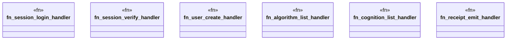

# `examples/receiptctl/src/verbs/handlers.rs`

Source SHA-256: `b7d4b9a9ddf2fca1efc5860df1632ca22934fec126bbf2b3f11425b7ca9ad094`

## Dependencies

- `chrono::Utc`
- `clap_noun_verb::Result`
- `crate::w4pm_algorithms_catalog::CATALOG as ALGORITHM_CATALOG`
- `crate::w4pm_cognition_catalog::BREED_CATALOG`
- `crate::wasm4pm_compat_events::emit_receipt_chained`
- `serde_json::{json, Value}`
- `std::hash::{DefaultHasher, Hash, Hasher}`

## Standing

- Structural parse: `ALIVE`
- Runtime behavior: `UNKNOWN`
