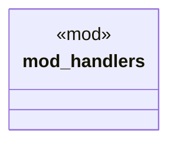

# `examples/receiptctl/src/verbs/mod.rs`

Source SHA-256: `2ac6a57af58c242e1528cc01cc2ca98b197887368739c181efced2a0c23df3f2`

## Dependencies

- None observed.

## Standing

- Structural parse: `ALIVE`
- Runtime behavior: `UNKNOWN`
