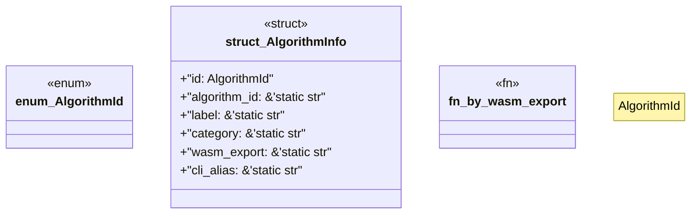

# `examples/receiptctl/src/w4pm_algorithms_catalog.rs`

Source SHA-256: `de5d61367a85323e4890662af080d057f92709734568408188a4a05cfbb1d39d`

## Dependencies

- None observed.

## Standing

- Structural parse: `ALIVE`
- Runtime behavior: `UNKNOWN`
