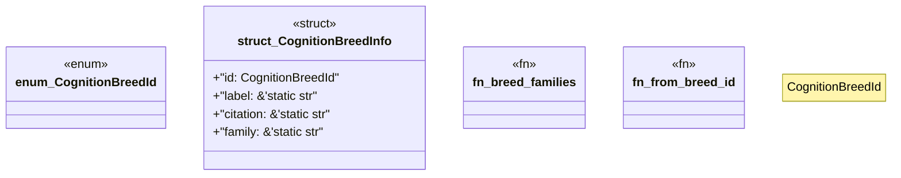

# `examples/receiptctl/src/w4pm_cognition_catalog.rs`

Source SHA-256: `6e868d2c2652d319ef0cb31b388d9624d4afacc40c78e58a2bfce1146fe28dde`

## Dependencies

- None observed.

## Standing

- Structural parse: `ALIVE`
- Runtime behavior: `UNKNOWN`
