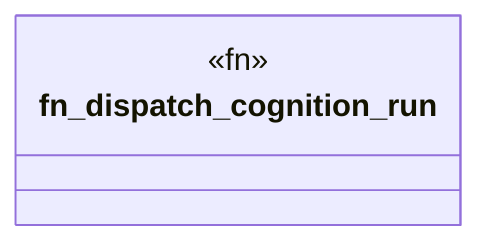

# `examples/receiptctl/src/w4pm_cognition_dispatch_handler.rs`

Source SHA-256: `a8f8b2df954df839a3bb73f228d0ca8389b365d7d0a585d2a881f1d46ef48962`

## Dependencies

- None observed.

## Standing

- Structural parse: `ALIVE`
- Runtime behavior: `UNKNOWN`
