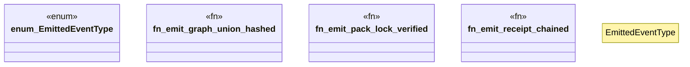

# `examples/receiptctl/src/wasm4pm_compat_events.rs`

Source SHA-256: `8f3bcb9508a64ad8a0aac202868675bb19f3e53206742682f35a7a51d93e13ec`

## Dependencies

- `chrono::{DateTime, FixedOffset}`
- `wasm4pm_compat::ocel::{OCELAttributeValue, OCELEvent, OCELEventAttribute, OCELRelationship}`

## Standing

- Structural parse: `ALIVE`
- Runtime behavior: `UNKNOWN`
