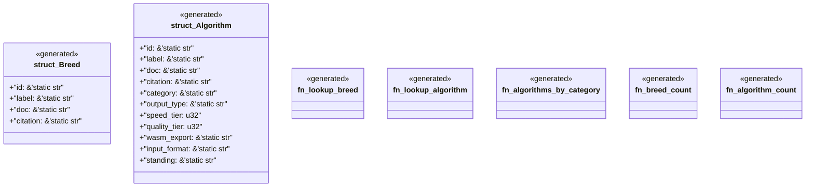

# `examples/receiptctl/src/wasm4pm_facts_registry.rs`

Source SHA-256: `9b47642a7a37528bff37025db3e9e0a2b09e3df7197fbf6e278f63c195c030f6`

## Dependencies

- None observed.

## Standing

- Structural parse: `ALIVE`
- Runtime behavior: `UNKNOWN`
