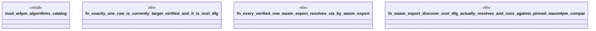

# `examples/receiptctl/tests/algorithms_target_fidelity_proof.rs`

Source SHA-256: `b34724ad5d71991cec6cf06c2b371e9561aee09343b74bcddf7c1ba52c22167b`

## Dependencies

- `chrono::DateTime`
- `w4pm_algorithms_catalog::{by_wasm_export, AlgorithmId}`
- `wasm4pm_compat::ocel::{OCELEvent, OCELRelationship, OCELType, OCEL}`

## Standing

- Structural parse: `ALIVE`
- Runtime behavior: `UNKNOWN`
