# `examples/receiptctl/tests/chicago_tdd_tools_boundary.rs`

Source SHA-256: `55d22f62f8f94626fbee7faa88ed7b789ad729d9096fce25d0f45854431a3343`

```mermaid
classDiagram
    class fn_receiptctl_algorithm_list_succeeds {
      <<generated>>
    }
    class fn_receiptctl_help_lists_verbs {
      <<generated>>
    }
    class fn_receiptctl_known_noun_unrecognized_verb_fails_closed {
      <<generated>>
    }
    class fn_receiptctl_receipt_emit_fails_without_required_arg {
      <<generated>>
    }
    class fn_receiptctl_session_login_fails_without_required_arg {
      <<generated>>
    }
    class fn_receiptctl_unexpected_flag_fails_closed {
      <<generated>>
    }
    class fn_receiptctl_unknown_verb_fails_closed {
      <<generated>>
    }
    class fn_receiptctl_user_create_fails_without_required_arg {
      <<generated>>
    }
    class fn_receiptctl_version_emits_name {
      <<generated>>
    }
```

## Dependencies

- None observed.

## Standing

- Structural parse: `ALIVE`
- Runtime behavior: `UNKNOWN`
