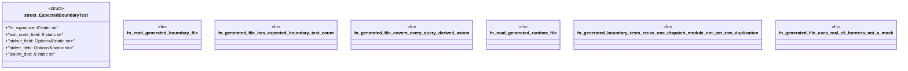

# `examples/receiptctl/tests/chicago_tdd_tools_boundary_proof.rs`

Source SHA-256: `17e30c47d5bc7cedd1f919ede9ce4670dfd1b57b278f4b229a6f7fe337fb446e`

## Dependencies

- `std::env`
- `std::fs`
- `std::path::PathBuf`

## Standing

- Structural parse: `ALIVE`
- Runtime behavior: `UNKNOWN`
