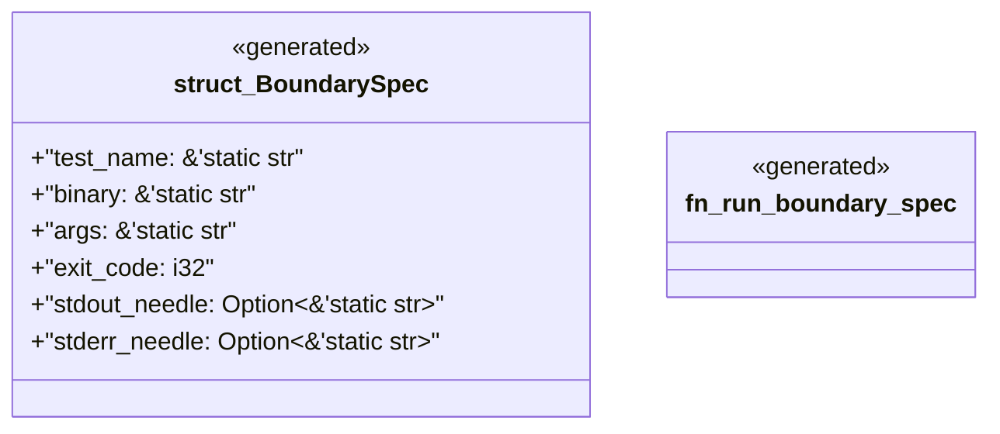

# `examples/receiptctl/tests/chicago_tdd_tools_boundary_runtime.rs`

Source SHA-256: `594a7ce5ee9b6530c7ff1250ee82b325bb3d69c75be3800e5a210adcff35e51a`

## Dependencies

- `chicago_tdd_tools::cli_proof::CliHarness`

## Standing

- Structural parse: `ALIVE`
- Runtime behavior: `UNKNOWN`
