# `examples/receiptctl/tests/clap_noun_verb_sparql_derived_proof.rs`

Source SHA-256: `c8874987eb5739cf05f704aa700447ceef50af0deb626ac227896479c602ca4c`

```mermaid
classDiagram
    class struct_LiveArg {
      <<struct>>
      +"ident: &'static str"
      +"rust_type: &'static str"
      +"required: bool"
    }
    class struct_LiveCommand {
      <<struct>>
      +"noun: &'static str"
      +"verb: &'static str"
      +"fn_name: &'static str"
      +"handler: &'static str"
      +"doc: &'static str"
      +"return_type: &'static str"
      +"has_static_response: bool"
      +"args: &'static [LiveArg]"
    }
    class struct_LiveNoun {
      <<struct>>
      +"noun: &'static str"
      +"noun_upper: &'static str"
      +"about: &'static str"
    }
    class fn_routes_only {
      <<fn>>
    }
    class fn_assert_command_in_routes {
      <<fn>>
    }
    class fn_assert_command_in_docs_md {
      <<fn>>
    }
    class fn_assert_noun_in_routes {
      <<fn>>
    }
    class fn_sparql_queries_returned_at_least_one_row_each {
      <<fn>>
    }
    class fn_command_and_noun_counts_match_generated_routes_right_now {
      <<fn>>
    }
    class fn_every_live_command_matches_generated_routes_right_now {
      <<fn>>
    }
    class fn_every_live_command_matches_generated_docs_md_right_now {
      <<fn>>
    }
    class fn_every_live_static_response_matches_generated_routes_right_now {
      <<fn>>
    }
    class fn_every_live_noun_matches_generated_routes_right_now {
      <<fn>>
    }
    class fn_live_command_order_is_lexical_ascending_by_noun_then_verb {
      <<fn>>
    }
    class fn_live_noun_order_is_lexical_ascending {
      <<fn>>
    }
    class fn_generated_artifacts_reject_unknown_command {
      <<fn>>
    }
```

## Dependencies

- None observed.

## Standing

- Structural parse: `ALIVE`
- Runtime behavior: `UNKNOWN`
