# `examples/receiptctl/tests/sandbox_catalog_proof.rs`

Source SHA-256: `82fb718689ec30cd09575040beceb962d2276baddf68fb229588e071bcfc76e6`

```mermaid
classDiagram
    class mod_sandbox_catalog {
      <<mod>>
    }
    class mod_sandbox_actuator_trait {
      <<mod>>
    }
    class fn_find {
      <<fn>>
    }
    class fn_catalog_len_matches_sparql_derived_total {
      <<fn>>
    }
    class fn_capability_id_values_are_unique_across_the_catalog {
      <<fn>>
    }
    class fn_generated_full_field_assertions_over_every_catalog_row {
      <<fn>>
    }
    class fn_every_row_as_str_round_trips_through_from_capability_id {
      <<fn>>
    }
    class fn_from_capability_id_rejects_an_unrelated_string {
      <<fn>>
    }
    class fn_from_capability_id_rejects_empty_string {
      <<fn>>
    }
    class fn_execute_python_is_refused_without_compile_python_having_passed {
      <<fn>>
    }
    class fn_execute_python_is_admitted_once_compile_python_has_passed {
      <<fn>>
    }
    class fn_execute_python_is_refused_when_a_different_capability_passed_instead {
      <<fn>>
    }
    class fn_run_cargo_test_has_no_precondition_and_is_admitted_with_nothing_passed_yet {
      <<fn>>
    }
    class fn_compile_rust_has_no_precondition_and_is_admitted_from_a_cold_start {
      <<fn>>
    }
```

## Dependencies

- `sandbox_actuator_trait::{check_preconditions, CapabilityRefusal, CapabilityRequest}`
- `sandbox_catalog::{from_capability_id, CapabilityId, Operation, CAPABILITY_CATALOG}`
- `std::collections::HashSet`

## Standing

- Structural parse: `ALIVE`
- Runtime behavior: `UNKNOWN`
