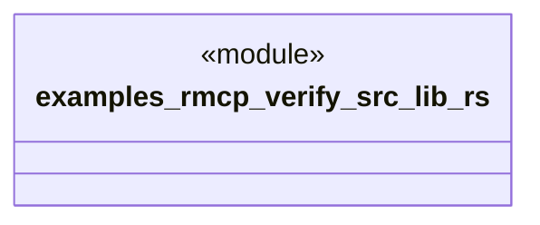

# `examples/rmcp-verify/src/lib.rs`

Source SHA-256: `19ed1f5db59c0f061ec2c52b041e7f0354ae3c9d38fde3de57db2c50c239ab03`

## Dependencies

- None observed.

## Standing

- Structural parse: `ALIVE`
- Runtime behavior: `UNKNOWN`
