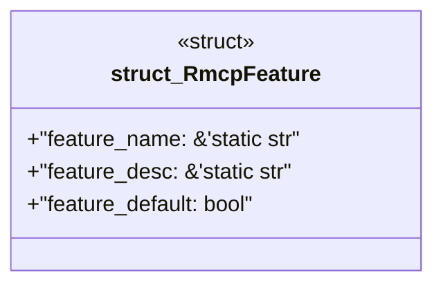

# `examples/rmcp-verify/src/rmcp_feature_catalog.rs`

Source SHA-256: `124fdb1026cb408afe3a8ccde50312015ab024f82a85f5d34bedbcbe60d78828`

## Dependencies

- None observed.

## Standing

- Structural parse: `ALIVE`
- Runtime behavior: `UNKNOWN`
