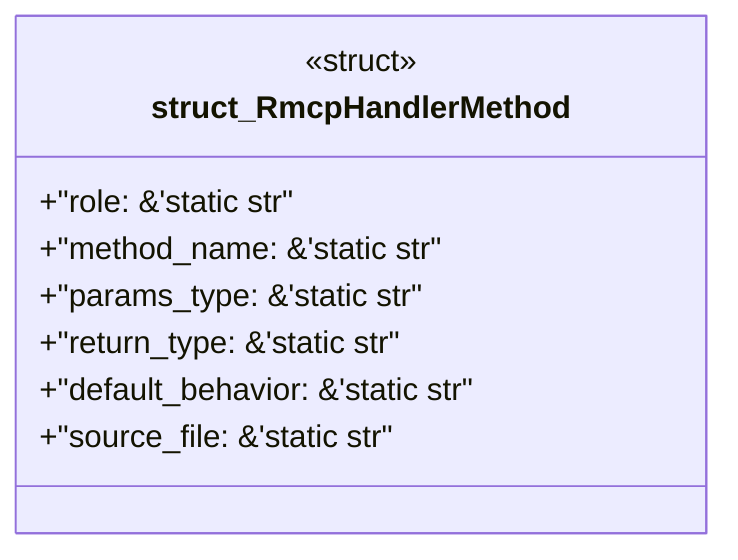

# `examples/rmcp-verify/src/rmcp_handler_catalog.rs`

Source SHA-256: `54ba45ab7823ae545175ea860ac6f1184386bcf326ebf79c5b3239a261fb44a5`

## Dependencies

- None observed.

## Standing

- Structural parse: `ALIVE`
- Runtime behavior: `UNKNOWN`
