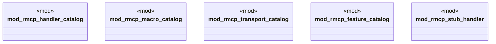

# `examples/rmcp-verify/src/rmcp_lib_wiring.rs`

Source SHA-256: `a93c5e8653ae843cce6376dc93ddada227df895d2e630c9fdab9d8fb2b4c962b`

## Dependencies

- None observed.

## Standing

- Structural parse: `ALIVE`
- Runtime behavior: `UNKNOWN`
