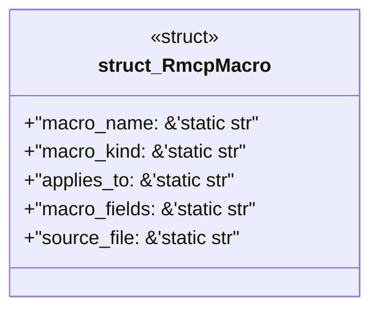

# `examples/rmcp-verify/src/rmcp_macro_catalog.rs`

Source SHA-256: `00659082abab86fdace1e8a9d0285aee1296a950be58c8c19ef1fd76c76c9052`

## Dependencies

- None observed.

## Standing

- Structural parse: `ALIVE`
- Runtime behavior: `UNKNOWN`
