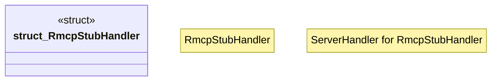

# `examples/rmcp-verify/src/rmcp_stub_handler.rs`

Source SHA-256: `401c99b816a3001bbfa879c08d98c24ba510fc06d5ff925a691129fe8ca1d72c`

## Dependencies

- `rmcp::{ServerHandler, model::ServerInfo, tool, tool_handler, tool_router}`

## Standing

- Structural parse: `ALIVE`
- Runtime behavior: `UNKNOWN`
