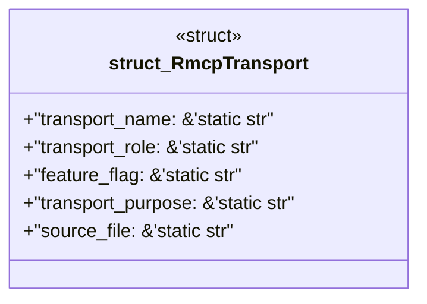

# `examples/rmcp-verify/src/rmcp_transport_catalog.rs`

Source SHA-256: `e25b2939084a3916eec592217341ea68e8325b04af91e93c8ba262250bc0f987`

## Dependencies

- None observed.

## Standing

- Structural parse: `ALIVE`
- Runtime behavior: `UNKNOWN`
