# `examples/rmcp-verify/tests/rmcp_default_handler_proof.rs`

Source SHA-256: `7ab727af6a0e4a3426d39fd16c81177090fc18cb539fc16554b67f77adefaf12`

```mermaid
classDiagram
    class struct_RmcpDefaultHandler {
      <<struct>>
    }
    class fn_ontology_still_claims_get_tool_returns_none {
      <<fn>>
    }
    class fn_default_handler_get_tool_genuinely_returns_none_for_an_unregistered_name {
      <<fn>>
    }
    class fn_default_handler_get_tool_refuses_an_empty_name_without_panicking {
      <<fn>>
    }
    class fn_default_handler_get_tool_refuses_an_adversarial_looking_name {
      <<fn>>
    }
    class fn_default_handler_is_constructible_via_default {
      <<fn>>
    }
    note "ServerHandler for RmcpDefaultHandler"
```

## Dependencies

- `rmcp::ServerHandler`

## Standing

- Structural parse: `ALIVE`
- Runtime behavior: `UNKNOWN`
