# `examples/rmcp-verify/tests/rmcp_handler_catalog_proof.rs`

Source SHA-256: `15410351140b09babf39d7907822d335537dfceacfdd555b57795b95b3eca3fd`

```mermaid
classDiagram
    class mod_rmcp_handler_catalog {
      <<generated>>
    }
    class fn_server_catalog_has_exactly_twenty_seven_methods {
      <<generated>>
    }
    class fn_client_catalog_has_exactly_sixteen_methods {
      <<generated>>
    }
    class fn_first_server_row_is_call_tool_with_its_real_doc_grounded_default_behavior {
      <<generated>>
    }
    class fn_last_server_row_is_unsubscribe {
      <<generated>>
    }
    class fn_first_client_row_is_create_elicitation {
      <<generated>>
    }
    class fn_last_client_row_is_ping {
      <<generated>>
    }
    class fn_exactly_four_server_methods_have_no_typed_params {
      <<generated>>
    }
    class fn_exactly_six_client_methods_have_no_typed_params {
      <<generated>>
    }
    class fn_both_catalogs_are_sorted_by_method_name {
      <<generated>>
    }
    class fn_neither_catalog_has_duplicate_method_names {
      <<generated>>
    }
    class fn_every_row_has_a_source_citation_and_default_behavior {
      <<generated>>
    }
    class fn_role_field_matches_the_array_each_row_lives_in {
      <<generated>>
    }
```

## Dependencies

- `rmcp_handler_catalog::{RMCP_CLIENT_METHODS, RMCP_SERVER_METHODS, RmcpHandlerMethod}`

## Standing

- Structural parse: `ALIVE`
- Runtime behavior: `UNKNOWN`
