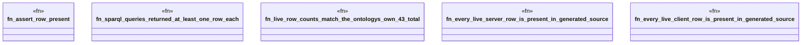

# `examples/rmcp-verify/tests/rmcp_handler_catalog_sparql_derived_proof.rs`

Source SHA-256: `f4e618ec01dd67370f1c4f3e4ba8b772d345976e3021b75c8048052a46226644`

## Dependencies

- None observed.

## Standing

- Structural parse: `ALIVE`
- Runtime behavior: `UNKNOWN`
