# `examples/rmcp-verify/tests/rmcp_stub_handler_proof.rs`

Source SHA-256: `63fb8f3a6e3235cbf7eeea80e27d043292eb9150a98c20be4ee5253505aec3f5`

```mermaid
classDiagram
    class mod_rmcp_stub_handler {
      <<generated>>
    }
    class fn_tool_router_associated_fn_exists_and_is_callable {
      <<generated>>
    }
    class fn_tool_router_lists_exactly_one_real_tool {
      <<generated>>
    }
    class fn_registered_tool_has_the_real_echo_name_and_description {
      <<generated>>
    }
    class fn_stub_handler_implements_real_server_handler_get_info {
      <<generated>>
    }
    class fn_stub_handler_is_constructible_via_default {
      <<generated>>
    }
```

## Dependencies

- `rmcp::ServerHandler`
- `rmcp::model::ServerInfo`
- `rmcp_stub_handler::RmcpStubHandler`

## Standing

- Structural parse: `ALIVE`
- Runtime behavior: `UNKNOWN`
