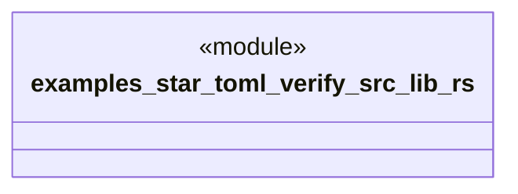

# `examples/star-toml-verify/src/lib.rs`

Source SHA-256: `1918448ec3a9df452bdfc289af17a84520a2d5277576fcacf6f09ff3c0470270`

## Dependencies

- None observed.

## Standing

- Structural parse: `ALIVE`
- Runtime behavior: `UNKNOWN`
