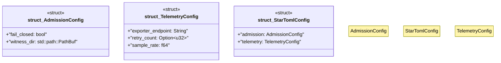

# `examples/star-toml-verify/src/star_toml_config.rs`

Source SHA-256: `1ad933dc4d55c958e75141a3d42c9895a0f344c3e7a499bead42935f1fa8e60d`

## Dependencies

- `serde::Deserialize`

## Standing

- Structural parse: `ALIVE`
- Runtime behavior: `UNKNOWN`
