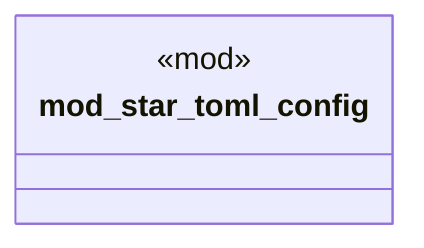

# `examples/star-toml-verify/src/star_toml_lib_wiring.rs`

Source SHA-256: `fbf75eb43d75f22dbeb8a796ec625df6526bd2560a8cb47e6dd641e3d7db3aae`

## Dependencies

- None observed.

## Standing

- Structural parse: `ALIVE`
- Runtime behavior: `UNKNOWN`
