# `examples/star-toml-verify/tests/star_toml_config_proof.rs`

Source SHA-256: `f64dd9ebe13cfb3da8deb198f4d0b38df027b618ea885265e15e7a56ffe37839`

```mermaid
classDiagram
    class mod_star_toml_config {
      <<generated>>
    }
    class fn_structural_shape_matches_ontology {
      <<generated>>
    }
    class fn_write_toml {
      <<generated>>
    }
    class fn_load_round_trip_matches_written_literals {
      <<generated>>
    }
    class fn_unknown_key_in_admission_is_rejected {
      <<generated>>
    }
    class fn_missing_required_field_is_rejected {
      <<generated>>
    }
    class fn_optional_field_omitted_deserializes_as_none {
      <<generated>>
    }
    class fn_missing_file_is_rejected_not_panicked {
      <<generated>>
    }
    class fn_out_of_range_sample_rate_parses_but_fails_validate {
      <<generated>>
    }
    class fn_in_range_sample_rate_passes_validate {
      <<generated>>
    }
```

## Dependencies

- `star_toml_config::{AdmissionConfig, StarTomlConfig, TelemetryConfig}`
- `tempfile::TempDir`

## Standing

- Structural parse: `ALIVE`
- Runtime behavior: `UNKNOWN`
