# `examples/star-toml-verify/tests/star_toml_config_sparql_derived_proof.rs`

Source SHA-256: `27c06c57f23900f541650058c542beeb1e714d5031177e2fc669709c8ad3411c`

```mermaid
classDiagram
    class fn_assert_section_present {
      <<fn>>
    }
    class fn_assert_field_present {
      <<fn>>
    }
    class fn_assert_bound_present {
      <<fn>>
    }
    class fn_sparql_queries_returned_at_least_one_row_each {
      <<fn>>
    }
    class fn_field_declaration_count_matches_generated_module_right_now {
      <<fn>>
    }
    class fn_every_live_section_and_field_matches_generated_module_right_now {
      <<fn>>
    }
    class fn_every_live_bound_matches_generated_validate_right_now {
      <<fn>>
    }
    class fn_live_loader_fn_matches_generated_load_right_now {
      <<fn>>
    }
    class fn_live_field_order_is_lexical_ascending_within_each_section {
      <<fn>>
    }
    class fn_generated_module_rejects_unknown_field_name {
      <<fn>>
    }
```

## Dependencies

- None observed.

## Standing

- Structural parse: `ALIVE`
- Runtime behavior: `UNKNOWN`
